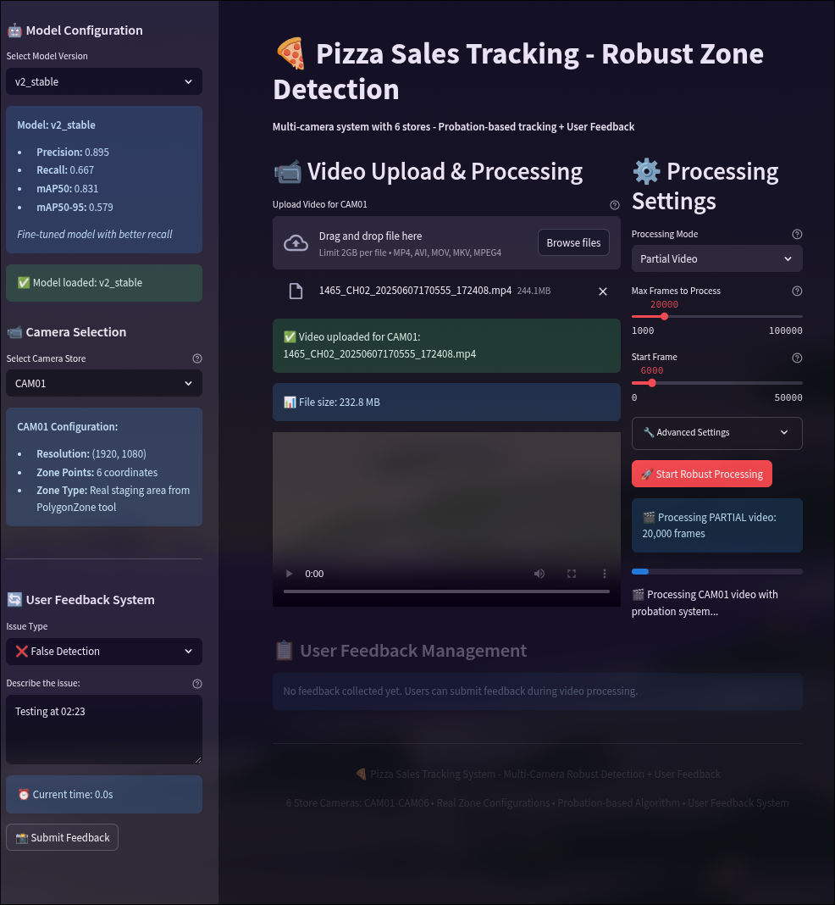
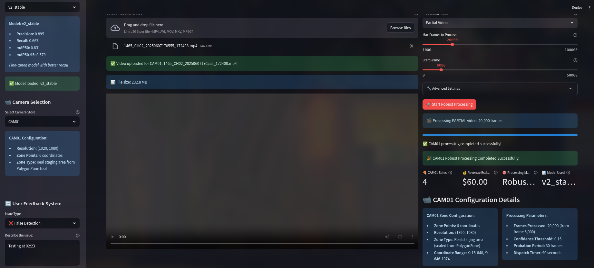
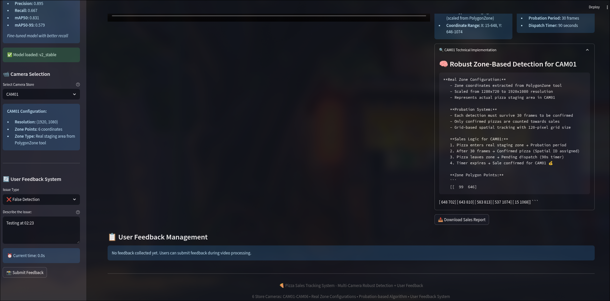

# Pizza Sales Monitoring System

An intelligent computer vision system for automated pizza counting and sales tracking using YOLOv8 object detection and zone-based counting logic across multiple store cameras.

## Overview

This system processes video feeds from 6 pizza store cameras (CAM01-CAM06) to automatically detect, track, and count pizzas in staging areas, providing real-time sales monitoring through a Streamlit web dashboard with user feedback capabilities.

## Model Information

### YOLOv8s Object Detection Model
- **Architecture**: YOLOv8s (small version for balanced speed and accuracy)
- **Input**: Video frames (640x640 pixels)
- **Training Data version 1**: 129 total images (53 original + 76 augmented)
- **Training Data version 2**: 540 total images (210 orgiginal + 330 augmented)
- **Training Environment**: Google Colab with NVIDIA L4 GPU (22GB memory)

### Model Performance Comparison

| Model Version | Precision | Recall | mAP@0.5 | mAP@0.5:0.95 | Model Size | Key Features |
|---------------|-----------|--------|---------|--------------|------------|--------------|
| v1 (stable) | 98.8% | 54.5% | 68.2% | 60.0% | 21.5 MB | High precision, NaN loss issues resolved |
| v2 (v2_stable) | 89.5% | 66.7% | 83.1% | 57.9% | 22.5 MB | Better recall (+12.2%), improved detection |

**Key Improvements in v2_stable:**
- **Recall Enhancement**: Increased from 54.5% to 66.7% (+12.2%)
- **mAP@0.5 Improvement**: Enhanced from 68.2% to 83.1% (+14.9%)
- **Balanced Trade-off**: Slight precision reduction (98.8% → 89.5%) for significantly better detection coverage
- **Practical Benefits**: Reduces missed pizza detections, flickering pizza object detection, pizza id explosion and improving sales accuracy

**Output Videos**
The processed video outputs for all six camera feeds are available for review on Google Drive. 

*   **Link:** [Output Videos Folder](https://drive.google.com/drive/folders/1auV7IkmjRXPIgGssgnFCcYE2S_ZzrQYJ?usp=drive_link)
*   **Access Note:** Please be aware that access to this folder is restricted and requires authorization.

## Project Structure

```
pizza_count_cv/
├── training/                    # Training pipeline
│   ├── notebooks/              # Training workflow documentation
│   │   ├── 01_data_exploration_eng.md    # Data preparation and frame extraction
│   │   ├── 02_colab_training_eng.md      # Model training on Google Colab
│   │   └── 03_multi_cam_inference_pipeline_eng.md  # Multi-camera inference testing on Google Colab
│   ├── data/                   # Training datasets
│   │   ├── raw/               # Original video files (6 cameras, 273.3 minutes)
│   │   ├── processed/         # Extracted frames (17,030 total)
│   │   └── annotations/       # Annotated datasets (129 images)
│   └── models/models/trained/ # Trained model weights
│       ├── pizza_detector_stable/       # Production model (v1)
│       └── pizza_detector_v2_stable/    # Enhanced model (improved recall)

pizza_sales_monitoring/         # Inference and web system
├── config/                    # Configuration files
│   ├── camera_config.py      # Camera zones and settings
│   ├── model_config.py       # Model parameters
│   └── streamlit_config.py   # Dashboard settings
├── core/                     # Core processing logic
│   └── robust_processor.py   # Main inference engine with probation system
├── models/                   # Model weights (copied from training)
│   ├── stable/              # Production model (v1)
│   └── v2_stable/           # Enhanced model (v2)
├── outputs/                  # Processing results
│   ├── processed_videos/    # Annotated output videos
│   └── feedback/            # User feedback data
├── utils/                    # Utility modules
│   ├── feedback_handler.py  # Feedback processing system
│   ├── ui_components/       # Streamlit UI components
│   └── video_processor.py   # Video processing utilities
└── videos/                   # Raw video storage
    ├── CAM01/ to CAM06/     # Individual camera video storage
```

## Training Pipeline

### Data Preparation Phase
- **Video Sources**: 6 store cameras with 273.3 minutes total footage
- **Frame Extraction**: Strategic sampling yielding 17,030 frames
- **Annotation Process**: 300 frames selected → 53 golden frames → 129 total with augmentation
- **Dataset Distribution version 1**: 114 training, 11 validation, 4 test images
- **Dataset Distribution version 2**: 210 images with annotation then augmented into a total of 540 images 495-31-14/Training-Validation-Test

#### **Video Sources and Initial Analysis**
The process began with raw data from **6 store cameras (CAM01-CAM06)**, amounting to **273.3 minutes** of total video footage. An initial exploration, outlined in the `01_data_exploration_eng.ipynb` notebook, was conducted to analyze video metadata. This revealed that while the videos shared a common resolution of 1920x1080 pixels, their frame rates varied. This analysis provided a comprehensive understanding of the source material before frame extraction. Follow along, a core strategic assumption was established from the outset: each of the six video feeds corresponds to a camera in a different store (although we can clearly see that some videos are from the same store). Approaching with this assumption will make the environment more independent, each camera acts as self-contained unit. In case, cross-check needed from multi camera from the store we can gather and combine information from each camera easily.
- CAM_01: 1465_CH02_20250607170555_172408.mp4
- CAM_02: 1464_CH02_20250607180000_190000.mp4
- CAM_03: 1467_CH04_20250607180000_190000.mp4 
- CAM_04: 1462_CH03_20250607192844_202844.mp4
- CAM_05: 1461_CH01_20250607193711_203711.mp4 
- CAM_06: 1462_CH04_20250607210159_211703.mp4

#### **Strategic Frame Extraction and Selection**
*   **Strategic Sampling**: To create a manageable yet diverse pool of images, a strategic sampling method was employed instead of processing all 273,078 raw frames. This process yielded a total of **17,030 frames**. This approach ensured representation from all cameras and time periods while significantly reducing the data handling workload.
*   **Curated Selection**: From this pool of 17,030 frames, a smaller subset of **300 frames** was initially selected for the annotation process. These frames were chosen to provide a balanced view across all six camera feeds.
*   **Golden Frame Identification**: The 300 frames were further scrutinized to identify **53 "golden frames"**. These were determined to be the highest-quality images, offering the clearest and most diverse examples of pizzas in the staging areas, making them ideal for building the core of the training dataset.

#### **Annotation Process and Data Augmentation**
*   **Annotation Rules**: The annotation process, will use roboflow on https://roboflow.com and its API for performed on the 53 golden frames, adhered to strict guidelines to ensure consistency:
    *   **Inclusions**: Only whole, finished pizzas in open boxes or on serving plates located within the designated staging areas were labeled.
    *   **Exclusions**: Items such as pizzas still in preparation, pizzas in closed boxes, partial or sliced pizzas, and promotional demo samples were explicitly excluded from annotation.
    *   **Edge Cases**: Specific rules were applied to handle challenging scenarios like glare, significant occlusion (over 50%), and pizzas located at the frame boundaries.
*   **Data Augmentation**: To expand the dataset and improve the model's ability to generalize, the 53 golden frames were augmented to create an additional **76 images**, bringing the total dataset size to **129 images**. The training notebook `02_colab_training_eng.md` specifies that these augmentations included techniques like *Rotation*, *Noise*, and *Brightness*.

#### **Dataset Distribution**
The prototype dataset v1 of 129 images was partitioned into three distinct sets to facilitate a standard machine learning workflow:
*   **Training Set**: **114 images** used to train the model.
*   **Validation Set**: **11 images** used to tune hyperparameters and evaluate the model during the training process.
*   **Test Set**: **4 images** reserved for the final, unbiased performance assessment of the trained model.

<!-- This meticulously prepared v1 dataset formed the basis for training the initial `pizza_detector-stable` model, which achieved the project's first benchmark results. -->
The second dataset v2 of 540 images was partitioned into three distinct sets to facilitate a standard machine learning workflow:
*   **Training Set**: **495 images** used to train the model.
*   **Validation Set**: **31 images** used to tune hyperparameters and evaluate the model during the training process.
*   **Test Set**: **14 images** reserved for the final, unbiased performance assessment of the trained model.


### Model Training Process
- **Base Model**: YOLOv8s pre-trained weights
- **Training Challenges**: NaN loss issues resolved through batch size optimization and AMP disabling
- **Training Configuration**: 100 epochs, batch size 8, learning rate optimization
- **Model Evolution**: v1 (stable) → v2 (v2_stable) with improved recall performance

### Multi-Camera Inference Development
- **Zone Definition**: PolygonZone tool for staging area coordinate mapping
- **Tracking Logic**: Zone-based pizza lifecycle (in_zone → pending_dispatch → dispatched)
- **Sales Algorithm**: 90-second dispatch threshold with probation-based (avoiding ghosting issues) confirmation
- **Robust Processing**: Spatial memory management to eliminate false positives

## Deployment Architecture

### Docker Compose Setup
- **Training Environment**: Google Colab environment with L4 GPU, standard CPU and RAM
- **Inference Container**: Streamlit web application 
- **Model Management**: Automated model switching between v1 and v2 versions


## Usage Instructions

### Model Training and testing inference pipeline
1. **Data Preparation**: Extract and annotate frames using provided notebooks: `01_data_exploration_eng.ipynb`
2. **Google Colab Training**: Use notebook `02_colab_training_eng.ipynb` for model training with GPU acceleration
3. **Model Evaluation**: Validate performance using notebook `03_multi_cam_inference_pipeline.ipynb` for testing inference pipeline

### System Deployment
1. ` git clone https://github.com/Daniel-LeTC/pizza_count_cv.git ` 
2. **Docker Setup**: `docker-compose up --build` for complete system deployment
3. **Web Access**: Streamlit dashboard available at `http://localhost:8501`

### Model Fine-tuning
- **Continuous Learning**: Feedback system enables model retraining with user corrections
- **Version Management**: Seamless switching between model versions based on performance metrics

### Dashboard app


### User Guide: Pizza Sales Tracking Application

**Image for streamlit app, front end of this project**

**Image after finishing processed videos**





This guide provides instructions on how to use the Streamlit application for processing, analyzing, and reviewing pizza sales videos. The application integrates the YOLOv8s model for detection and a robust zone-based tracking system to count sales.

The interface is divided into three main panels:
1.  **Left Sidebar**: For model, camera, and feedback configuration.
2.  **Center Panel**: For video upload and result playback.
3.  **Right Sidebar**: For processing settings.

#### **1. Configuration (Left Sidebar)**

Before processing, configure the model and select the target camera.

*   **Model Configuration**:
    *   Use the `Select Model Version` dropdown to choose the desired detection model (e.g., `v2_stable`).
    *   Below the dropdown, the system displays key performance metrics for the selected model, such as Precision, Recall, and mAP, allowing for an informed choice.
    *   A confirmation message (e.g., `Model loaded: v2_stable`) indicates that the model is ready.

*   **Camera Selection**[1]:
    *   Use the `Select Camera Store` dropdown to choose the camera feed you wish to analyze (e.g., `CAM01`).
    *   The system will display the pre-loaded configuration for that camera, including video resolution and details about its defined staging zone.

#### **2. Video Processing Workflow (Center & Right Panels)**

This is the core workflow for analyzing a video.

*   **Step 1: Upload Video**
    *   In the center panel, drag and drop the video file into the `Video Upload & Processing` area, or use the "Browse files" button.
    *   The application will show the uploaded file's name and size. A green confirmation message will appear upon successful upload.

*   **Step 2: Set Processing Parameters (Right Sidebar)**
    *   **Processing Mode**: Select the analysis mode. Currently, "Partial Video" is implemented, allowing you to process a specific segment of the video for testing and validation. You can also process for "Entire Video".
    *   **Max Frames to Process**: Use this slider to define the total number of frames to analyze from the starting point.
    *   **Start Frame**: Use this slider to set the frame where the analysis should begin.

*   **Step 3: Start Analysis**
    *   Once the video is uploaded and parameters are set, click the **`Start Robust Processing`** button.
    *   The application will display progress bars below the button, indicating the status of the batch processing job (e.g., `Processing PARTIAL video...`, `Processing CAM01 video...`).

*   **Step 4: Review Results**
    *   After the processing is complete, the annotated output video will be loaded into the video player in the center panel.
    *   Use the standard player controls (play, pause, seek) to review the detection and tracking results.
    > Important notice: this function is not available due to the reason that Docker cannot access to GPU available environment

#### **3. User Feedback System**

This system is designed to report model errors, enabling a "human-in-the-loop" process for future model improvements.

*   **How to Submit Feedback**:
    1.  While watching the processed video in the player, pause at the exact moment an error occurs (e.g., a missed pizza or an incorrect detection).
    2.  On the left sidebar, go to the `User Feedback System` panel.
    3.  Select the appropriate `Issue Type` from the dropdown (e.g., `False Detection`, `Missed Detection`).
    4.  The system automatically captures the `Current time:` from the video player.
    5.  In the `Describe the issue:` text box, provide a brief but clear description of the error.
    6.  Click the `Submit Feedback` button.
    > Important notice: this function is not available due to the reason that review results above is not functioning

## System Performance

### Technical Specifications
- **Inference Speed**: ~30 FPS on GPU-enabled systems, however much more lower on CPU-based inference systems

### Technical Limitations and Pending Implementations

While the core detection and counting pipeline has been successfully developed and validated, there are several key areas that represent the current technical limitations and the immediate focus for future enhancement.

*   **Partially Implemented Feedback Loop**
    The system architecture includes a Streamlit dashboard designed for user interaction, which features a front-end interface for submitting feedback on model performance. However, the backend component (`feedback_handler.py`) responsible for processing these submissions is currently a placeholder and not yet operational. As a result, the "human-in-the-loop" mechanism, which is critical for continuous model improvement, is not yet functional.

*   **Deployment Performance Gap (CPU vs. GPU)**
    There is a significant performance disparity between the development environment and the current deployment package. The model training and inference pipeline were developed and optimized on a GPU-accelerated Google Colab environment (NVIDIA L4 GPU), achieving processing speeds suitable for near real-time analysis (e.g., 30 FPS). In contrast, the current Docker deployment is configured for a CPU-only environment. This hardware constraint severely limits inference speed, making the deployed system substantially slower than the validated development pipeline.

*   **Operational Mode: Asynchronous Batch Processing**
    As a direct consequence of the CPU-bound Docker environment, the system cannot perform live video stream analysis. The current operational workflow is limited to asynchronous batch processing. Users must submit a video file for processing and then wait for the task to complete before retrieving the annotated output video from a designated directory (`pizza_sales_monitoring/outputs/`). This precludes any real-time monitoring capabilities, which would be achievable in a GPU-enabled deployment.


